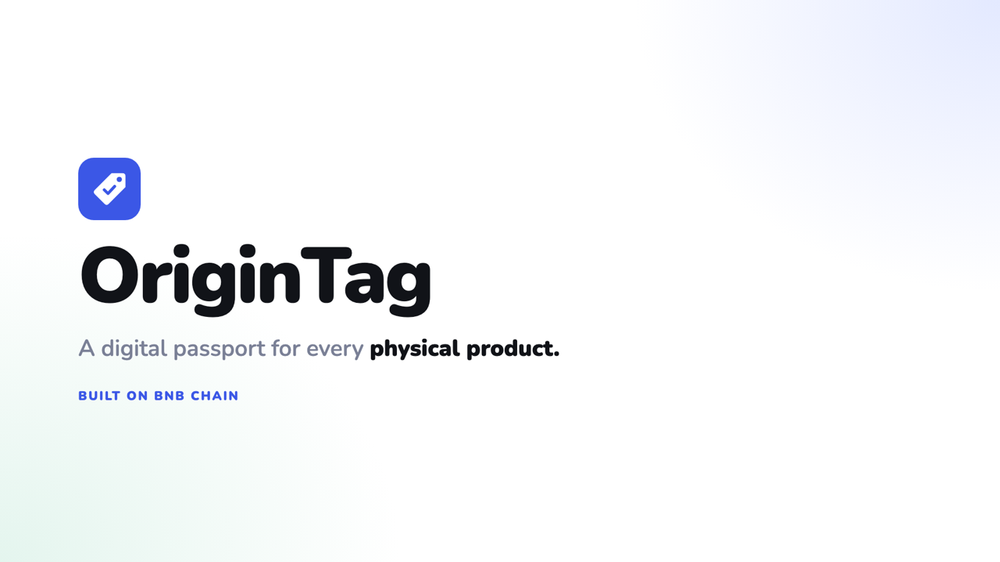
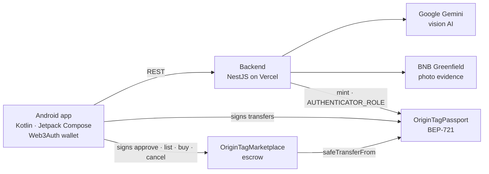

<p align="center">
  
</p>

<h1 align="center">OriginTag</h1>

<p align="center"><b>A digital passport for every physical product — on BNB Chain.</b></p>

<p align="center">
  <a href="https://drive.google.com/file/d/13_7s_yVODq9j0pPrzVbWBN31GqKzMSxr/view?usp=drivesdk">Download APK</a> ·
  <a href="pitch/OriginTag-Demo.mp4">Demo video</a> ·
  <a href="pitch/OriginTag-Pitch-Deck.pptx">Pitch deck</a> ·
  <a href="https://origintag-api.vercel.app/marketplace">Live API</a>
</p>

---

OriginTag gives every physical item — sneakers, watches, luxury bags — a **BEP-721 passport** that follows it for life. A vision AI checks authenticity before a passport is minted, every change of hands is recorded on-chain, and owners can resell through an **escrow marketplace**. Everything runs from an Android app with Google sign-in, so users never deal with a seed phrase.

[](pitch/OriginTag-Demo.mp4)

## Features

- **AI authenticity check** — Google Gemini scores item photos 0–100. Items scoring **70+** are minted; lower scores are flagged for manual review (a single catalog photo scored 45 in our tests).
- **Digital passport** — BEP-721 token with brand, category, serial, warranty, AI score and the BNB Greenfield evidence ID.
- **Permanent ownership history** — recorded in the contract's `_update()` hook, so mints, transfers *and* marketplace sales are all captured.
- **Escrow marketplace** — list, buy and cancel with native tBNB; NFT and payment swap atomically, 2% platform fee, overpayment refunded.
- **Trust score, recalls & service records** — owner reputation, brand recalls and repair history attached to each passport.
- **Explore & QR verify** — browse verified passports or scan an item's QR code.
- **No seed phrase** — Google / email login through Web3Auth; ownership actions are signed on the device.

## Architecture



The backend builds **unsigned transactions**; every ownership action is signed in the app with the user's Web3Auth key. Only minting goes through the backend, which holds `AUTHENTICATOR_ROLE` and mints after the AI check.

## Smart contracts (BSC Testnet)

| Contract | Address |
|---|---|
| OriginTagPassport (BEP-721) | [`0xE3Be425968a96A79FC5a9bd370cc075247BD7b00`](https://testnet.bscscan.com/address/0xE3Be425968a96A79FC5a9bd370cc075247BD7b00) |
| OriginTagMarketplace (escrow) | [`0xcE03f725544ed187776af608780A3F95df06F339`](https://testnet.bscscan.com/address/0xcE03f725544ed187776af608780A3F95df06F339) |

Solidity 0.8.28 · OpenZeppelin 5 (`ERC721Enumerable`, `AccessControl`, `ReentrancyGuard`) · 15 Hardhat tests.

## Repository

```
OriginTag/
├── contracts/   Solidity contracts, tests and deploy script (Hardhat)
├── backend/     NestJS API: AI check, Greenfield upload, tx builder, verify page (deployed on Vercel)
├── android/     Android app (Kotlin, Jetpack Compose, Hilt, Web3Auth, web3j)
├── branding/    Logo (SVG / PNG)
└── pitch/       Pitch deck, demo video and thumbnail
```

## Try it

1. Download the [APK](https://drive.google.com/file/d/13_7s_yVODq9j0pPrzVbWBN31GqKzMSxr/view?usp=drivesdk) and allow installs from unknown sources.
2. Sign in with Google (or tap **Lewati (mode demo)** to look around without a wallet).
3. Explore passports, register an item, or open the marketplace.

Buying, selling and transferring are signed by your own wallet, so they need a little **tBNB** for gas ([BSC Testnet faucet](https://www.bnbchain.org/en/testnet-faucet)). Registering an item and browsing are free.

## Run it yourself

**Prerequisites:** Node.js 20+, Android Studio with JDK 17+, and three testnet wallets funded with tBNB:

| Wallet | Role | Used in |
|---|---|---|
| Deployer | Contract admin | `contracts/.env` → `PRIVATE_KEY` |
| Backend authenticator | Mints passports (`AUTHENTICATOR_ROLE`) | `backend/.env` → `AUTHENTICATOR_PRIVATE_KEY` |
| Greenfield | Uploads photo evidence | `backend/.env` → `GREENFIELD_PRIVATE_KEY` |

Never commit `.env`, `local.properties` or keystores — they are gitignored.

### 1. Contracts

```bash
cd contracts
npm install
cp .env.example .env     # PRIVATE_KEY, BACKEND_AUTHENTICATOR_ADDRESS (gets AUTHENTICATOR_ROLE)
npm test
npm run deploy:testnet   # prints the passport and marketplace addresses
```

Optional: `MARKETPLACE_FEE_RECIPIENT` and `MARKETPLACE_FEE_BPS` (default: deployer, 200 = 2%).

### 2. Backend

```bash
cd backend
npm install
cp .env.example .env     # contract addresses, AUTHENTICATOR_PRIVATE_KEY, AI_API_KEY, GREENFIELD_*
npm run start:dev
```

- `AI_API_KEY` is a Google AI Studio key ([get one](https://aistudio.google.com/apikey)); leave it empty to run the AI in mock mode (fixed score 92).
- Leave `GREENFIELD_PRIVATE_KEY` empty to skip real evidence uploads.

**Deploying to Vercel:** import the repo, set **Root Directory** to `backend`, framework preset **Other**, and add the same variables as `backend/.env` (except `PORT`). `vercel.json` routes every request to the serverless handler in `src/vercel.ts`.

### 3. Android app

Create `android/local.properties` (gitignored):

```properties
sdk.dir=/path/to/Android/sdk
WEB3AUTH_CLIENT_ID=<client id from dashboard.web3auth.io>
```

In the [Web3Auth dashboard](https://dashboard.web3auth.io), create a **Sapphire Devnet** project and whitelist the redirect URL `com.origintag.app://auth`.

- **Debug builds** call the backend at the LAN address in `android/app/build.gradle.kts` (`API_BASE_URL`) — set it to your machine's IP.
- **Release builds** call `releaseApiBaseUrl` (the Vercel URL) over HTTPS only.

```bash
cd android
./gradlew installDebug       # debug build on a connected device / emulator
./gradlew assembleRelease    # signed release APK
```

Release signing reads `RELEASE_STORE_FILE`, `RELEASE_STORE_PASSWORD`, `RELEASE_KEY_ALIAS` and `RELEASE_KEY_PASSWORD` from `local.properties`. Keep the keystore and those values backed up — updates to an installed APK must be signed with the same key.

## Known limitations

- Testnet only (BSC Testnet + Greenfield Testnet); new wallets need tBNB for marketplace actions.
- Public BSC RPCs rate-limit `eth_getLogs`, so the recall / service-record lists are tracked in backend memory and may reset when the server restarts (the events stay on-chain).

## Team

Built solo by **Raihan Ghifari** — smart contracts, backend, AI pipeline and Android app.
