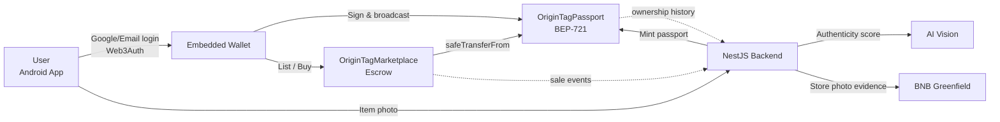
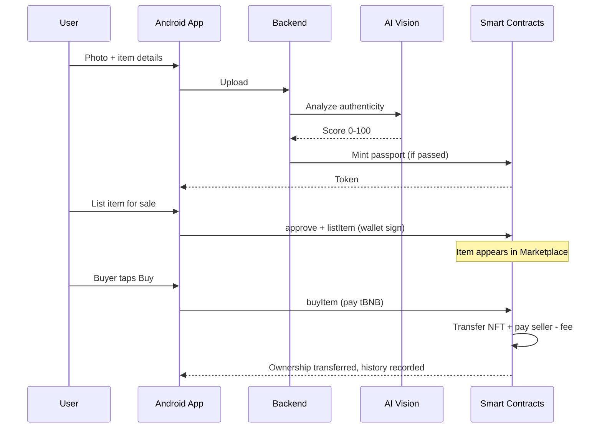

# OriginTag — Submission Portal (copy-paste ready)

> Important notes before submitting:
> - **NETWORK**: contracts are deployed on **BSC Testnet (chainId 97)**, not Mainnet. If the dropdown has a Testnet option, pick it. If it only offers Mainnet, note in Project Detail that the demo runs on Testnet.
> - **CONTRACT ADDRESS**: use the Passport contract below. The Marketplace address goes in Project Detail.
> - Fields marked `⚠️ FILL YOURSELF` need links only you have.

---

## PROJECT NAME
```
OriginTag
```

## TAGLINE (one sentence)
```
An on-chain digital passport that proves a physical product is authentic, tracks its full ownership history, and lets owners resell it with escrow — all from one phone.
```

## TRACK (select all 3 — all apply)
- ✅ **AI Agents** — AI vision scores product-photo authenticity (0–100) before a passport is minted.
- ✅ **Finance & Commerce** — on-chain escrow marketplace (native tBNB, 2% fee).
- ✅ **Consumer Apps** — a consumer Android app with seedless social login.

## CONTRACT ADDRESS
```
0xE3Be425968a96A79FC5a9bd370cc075247BD7b00
```

## NETWORK
```
BSC Testnet (chainId 97) — see note above
```

## PROJECT LOGO
`⚠️ FILL YOURSELF` — upload the OriginTag logo (square PNG, min 256×256).

---

## PROBLEM STATEMENT
```
Counterfeiting of luxury and premium goods is a trillion-dollar problem. Paper certificates are easily forged and lost; warranty cards can't be verified; and when an item is resold, buyers have no way to confirm it's genuine or trace who owned it before. Brands lose all control the moment a product leaves the store, and consumers buy with zero proof. There is no single trusted source of truth for a physical item's identity across its entire lifetime.
```

## SOLUTION
```
OriginTag gives every physical item a "digital passport" as a BEP-721 NFT on BNB Chain. At registration, the item's photo is analyzed by AI vision to produce an authenticity score; if it clears the threshold, a passport is minted to the owner's wallet with the photo evidence stored on BNB Greenfield. Every change of hands is automatically recorded as an immutable ownership history. Owners can resell through an on-chain escrow marketplace — the NFT and payment move atomically in a single transaction. On top of that: an owner trust score, brand recall status, service records, and QR-scan verification. Everything is accessed from an Android app with Google/email login (Web3Auth, no seed phrase), so even non-crypto users can start instantly.
```

---

## PROJECT DETAIL (markdown + mermaid)
```markdown
## What is OriginTag

OriginTag is a **digital passport for physical goods** on BNB Chain. One item = one NFT (BEP-721) that stores its identity, authenticity, warranty, and full ownership history on-chain.

## Why it matters

- **Anti-counterfeit**: authenticity is AI-scored, the evidence is stored on BNB Greenfield, and the certificate lives on-chain — impossible to forge.
- **Permanent history**: every transfer/sale is recorded automatically via the contract's `_update()` hook, so the chain of ownership is always intact.
- **Safe resale**: the escrow marketplace moves the NFT + funds in a single atomic transaction.
- **Non-crypto friendly**: Google/email login via Web3Auth, no seed phrase.

## Core features

| Feature | Description |
|---------|-------------|
| AI Authenticity Score | Item photo → AI vision → 0–100 score; a threshold decides mint vs. flag |
| Digital Passport | BEP-721 NFT: brand, category, serial, warranty, score, Greenfield evidence |
| Ownership History | Recorded automatically for all transfer paths, including marketplace sales |
| Marketplace Escrow | List / Buy / Cancel, native tBNB payments, 2% fee, overpayment refund |
| Trust Score | Owner reputation from items owned, high scores, and sales |
| Recall & Service Records | Brands can flag recalls; service history stays attached to the passport |
| QR Verify | Scan to check authenticity & history straight from the app |

## Architecture



## Registration & resale flow



## Smart contracts (BSC Testnet)

- **OriginTagPassport** (BEP-721 + AccessControl + Enumerable): `0xE3Be425968a96A79FC5a9bd370cc075247BD7b00`
- **OriginTagMarketplace** (escrow, ReentrancyGuard): `0xcE03f725544ed187776af608780A3F95df06F339`

## Tech stack

- **Contracts**: Solidity 0.8.28, OpenZeppelin 5.x, Hardhat
- **Backend**: NestJS 11, ethers v6, AI vision, BNB Greenfield SDK
- **Mobile**: Android Kotlin + Jetpack Compose, Web3Auth (social login), web3j, CameraX + ML Kit (QR scan)

## Demo status

Verified end-to-end on BSC Testnet: item registration with an AI score, passport mint, marketplace escrow (NFT moves to the buyer, seller paid after the 2% fee), and ownership history that captures marketplace sales.
```

---

## GITHUB REPO (public)
```
https://github.com/reyghifari/OriginTag
```
⚠️ Make sure the repo is set to **Public** before submitting.

## PROJECT WEBSITE
`⚠️ FILL YOURSELF / leave blank` — optional.

## DEMO VIDEO (YouTube)
`⚠️ FILL YOURSELF` — required. Record an app demo (register → list → buy).

## X / TWITTER
`⚠️ FILL YOURSELF / leave blank` — optional.

## LINKEDIN
`⚠️ FILL YOURSELF / leave blank` — optional.

## PITCH DECK (Canva / Drive)
`⚠️ FILL YOURSELF` — required. Canva/Drive link (set to "anyone with link").
