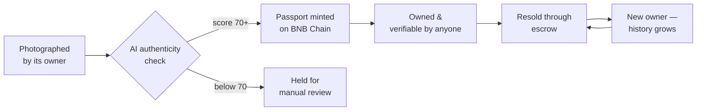

## A pair of sneakers, a stranger, and a leap of faith

You find the limited-edition sneakers you've wanted for months, listed by a stranger online. The photos look right. The box looks right. The receipt looks right. You pay — and only when they arrive do you realise they're fake.

This happens every day with sneakers, watches and luxury bags. The certificate that proves an item is real is a piece of paper anyone can print. The warranty card gets lost. And once a product leaves the store, nobody — not the buyer, not even the brand — can see where it has been.

**OriginTag exists so that the next buyer doesn't have to take anyone's word for it.**

## A passport that travels with the item

OriginTag gives every physical product a digital passport: a BEP-721 token on BNB Chain that holds the item's brand, serial number, warranty and authenticity score, and — most importantly — the full list of everyone who has ever owned it.

The passport is created once and follows the item for the rest of its life. It can't be forged, it can't be lost, and its history can't be quietly rewritten.

## Following one item through its life

It starts with a photo. The owner snaps the item in the app and adds the brand, serial number and warranty. A vision AI studies the photos and scores the item's authenticity from 0 to 100.

This step is a real gate, not a rubber stamp. When we tried to register a sneaker using a single catalog image, the AI scored it **45 out of 100** and refused to mint a passport — it flagged the item for manual review instead. Only items that clear the threshold of 70 get a passport, and the photo evidence is stored permanently on **BNB Greenfield**.

From there, the passport lives in the owner's wallet. Anyone can look it up, browse other verified items, or scan a QR code to check a product before buying it.

When the owner decides to sell, they set a price and the item appears in the marketplace. A buyer pays, and an **escrow contract** does the rest in a single transaction: the passport moves to the buyer, the seller receives the payment minus a 2% fee, and the new owner is added to the item's history. No middleman holds the money, and no one can take the payment without delivering the passport. Changed your mind before it sells? You can cancel the listing at any time.

Over years and many owners, that history becomes the item's reputation — and every owner builds a reputation of their own through a trust score.

## Built for people who have never touched crypto

Most people buying sneakers don't want to learn about seed phrases, so OriginTag doesn't ask them to. You sign in with Google or email, and a wallet is created for you behind the scenes. Every action that moves ownership — listing, buying, cancelling, transferring — is signed on your own phone, so your items are always under your control.

## Why BNB Chain

An item may change hands many times in its life, so every transfer needs to be cheap and fast — which is exactly what BNB Smart Chain offers. BNB Greenfield keeps the photo evidence alongside the passport, so the proof lives in the same ecosystem as the record.

## Where it stands today

OriginTag is live on BSC Testnet. The Android app, the AI check, the passport contract and the escrow marketplace all work end to end: we've registered items, bought, listed and cancelled — all signed from the app and confirmed on-chain. The two smart contracts are covered by 15 passing tests, and the passport contract already supports product recalls and service records.

- Passport contract: `0xE3Be425968a96A79FC5a9bd370cc075247BD7b00`
- Marketplace contract: `0xcE03f725544ed187776af608780A3F95df06F339`

## What comes next

The next step is to bring brands in at the moment of sale: NFC tags on products, a brand portal for verified minting and recalls, an iOS app, and finally a launch on BNB Smart Chain mainnet. The 2% marketplace fee funds the platform from day one.

The goal is simple: one day, "does it have an OriginTag?" should be the first question anyone asks before buying something second-hand.

---

*Built solo by Raihan Ghifari · [GitHub](https://github.com/reyghifari/OriginTag)*
